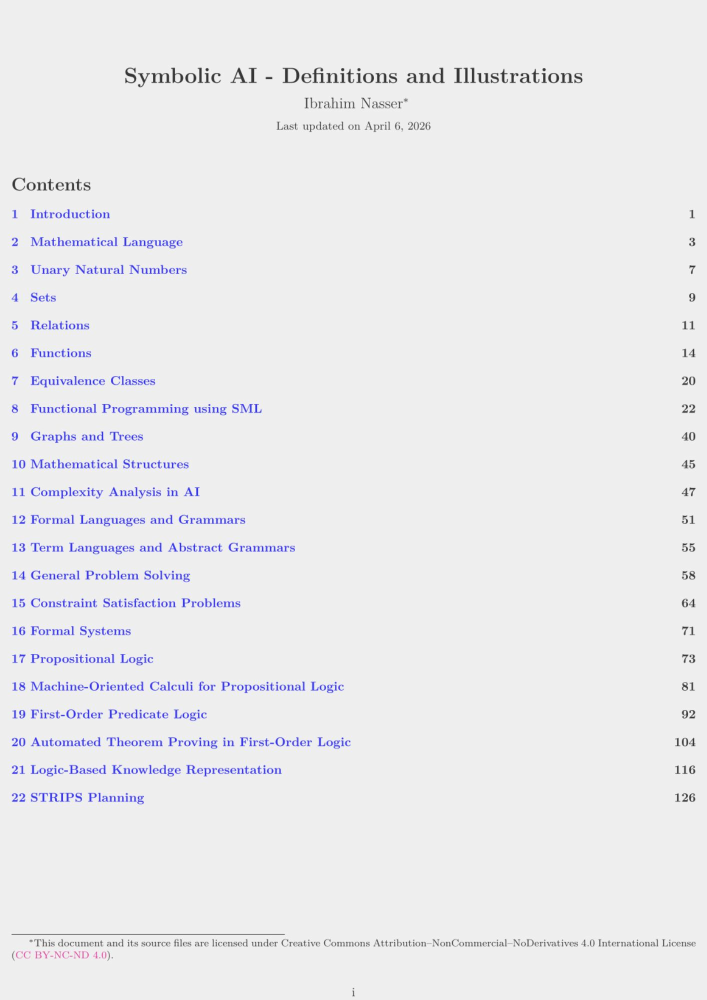

# Symbolic AI - Definition and Illustrations

  
  
  

  

> **Disclaimer:** This document is an independent summary by [Ibrahim Nasser](https://96ibman.github.io/ibrahim-nasser/) as a personal learning and documentation effort for the courses [Symbolic Methods for AI](https://alea.education/FAU/smai/WS25-26) and [AI 1: Artificial Intelligence 1](https://alea.education/course-home/ai-1) taught by [Prof. Dr. Michael Kohlhase](https://kwarc.info/people/mkohlhase/).
It is not an official course document, and no guarantee is made for its correctness, completeness, or accuracy.
The material here is meant as an auxiliary resource for understanding the subjects and should not be used as the sole basis for exams preparation. The official lecture notes and course materials remain the authoritative reference.

## Topics Covered
**Mathematical Foundations**
- Mathematical Language
- Natural Numbers and Induction
- Set Theory (Sets, Function, Relations, Equivalence Classes)
- Graphs and Trees
- Abstract Algebra - Math Structures (Groups, Monoids, Rings, Magmas)

**Computer Science and Programming**
- Formal Languages, Grammars and Abstract Grammars
- Functional Programming using SML
- Complexity Analysis

**Artificial Intelligence & Search**
- General Problem Solving (Tree/Graph Search, BFS, DFS, ...)
- Adversarial Search (Minimax, Alpha-Beta Pruning)
- Constraint Satisfaction Problems
- STRIPS Planning

**Logic and Formal Systems**
- Formal Systems (Logical Systems, Derivation, Inference, Calculus)
- Propositional and First-Order Logic (Syntax and Semantics)
- Natural Deduction and Sequent Calculus
- Automated Theorem Proving (SAT, Tableaux, Resolution, Unification, DPLL)
- Knowledge Representation (ALC Logic)

## Feedback & Contributions
This summary is a **living document**. I may continue to revise, extend, and improve it over time. 
Spotted a mistake or have a suggestion? Feel free to [contact me](mailto:ibrahim.nasser@fau.de)!

## License
This document and its source files are licensed under Creative Commons Attribution--NonCommercial--NoDerivatives 4.0 International License ([CC BY-NC-ND 4.0](https://creativecommons.org/licenses/by-nc-nd/4.0/legalcode)).

